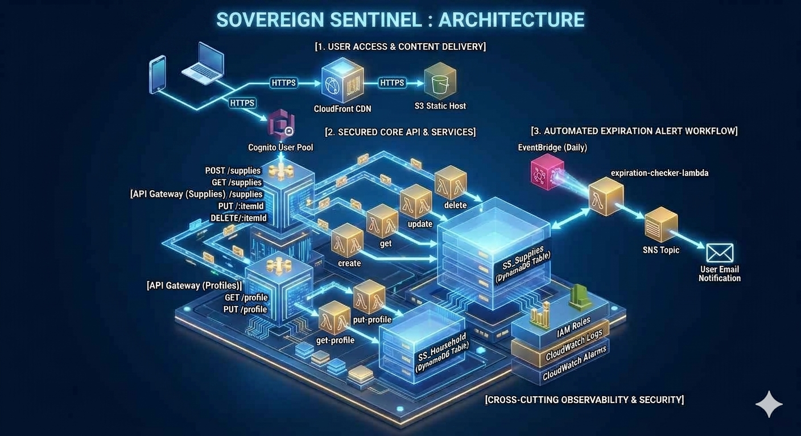

# Sovereign Sentinel (PrepTrack)

> **AWS Serverless Emergency Supply Tracking Application**  
> *A multi-tenant, event-driven web application featuring three-layer security, IDOR resistance, and zero-trust user data isolation.*

[](https://aws.amazon.com/)
[](#-security--hardening-architecture)
[](#-project-status--demonstration)

---

##  Executive Summary

**Sovereign Sentinel** is a serverless AWS emergency supply tracking application designed to enforce strict multi-tenant data isolation. Built as an AWS re/Start capstone project, the system implements defense-in-depth across the network, identity, and authorization layers to guarantee that user data remains isolated at scale.

---

## Project Status & Demonstration

> **Note on Live Demonstration:**  
> To optimize cloud resource management and avoid ongoing AWS hosting fees following project completion, active live deployment endpoints have been archived. 
> 
> Full application architecture, IAM security configurations, backend Lambda function logic, and verified test execution logs are available directly within this repository:
> *  **Architecture & Flow:** [Architecture Diagrams](./Architecture_Diagrams/)
> *  **Verified Security Test Artifacts:** [Security Testing Logs](./docs/)
> *  **Backend Logic & Lambda Functions:** [Backend Source Code](./Lambda.md)

---

##  System Architecture



* **Frontend:** Mobile-first static application designed for **Amazon S3** distribution via **Amazon CloudFront** over HTTPS.
* **Authentication & Identity:** **Amazon Cognito User Pools** handling user signup, email verification, JWT session token generation, and identity federation.
* **API Routing:** **Amazon API Gateway** protected by a **Cognito Authorizer**, enforcing token validity at the edge and blocking unauthenticated traffic (401 Unauthorized) before backend execution.
* **Compute & Logic:** **AWS Lambda** functions handling core CRUD operations, JSON serialization, and dynamic payload parsing.
* **Storage Tier:** **Amazon DynamoDB** (`SS_Supplies` table) using composite partition/sort keys (`userId` + `itemId`) mapped directly to Cognito UUIDs.
* **Alerting & Automation:** **Amazon EventBridge** daily cron triggers firing automated supply expiration scans, routing alerts via per-user **Amazon SNS** topics.

---

##  Security & Hardening Architecture

### 1. IDOR Prevention Pattern
Rather than relying on client-supplied parameters in request bodies or query strings, backend Lambda functions extract identity exclusively from validated Cognito JWT claims:
```javascript
// Extracting user identity directly from verified JWT claim
const userId = event.requestContext.authorizer.claims.sub;
